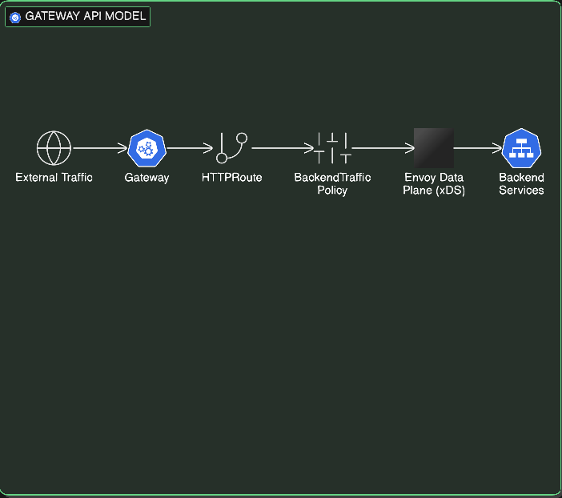
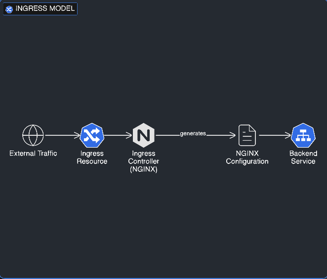

# From Ingress to Gateway API  
## A Structural Comparison of Kubernetes Networking Models

This project provides a hands-on architectural comparison between Kubernetes Ingress (NGINX) and the Gateway API using Envoy Gateway.

It explores how Kubernetes networking is evolving from annotation-driven configuration toward a strongly typed, policy-oriented model aligned with modern platform engineering practices.

---

## Background

Kubernetes Ingress has been widely adopted as the entry point for HTTP traffic into clusters. However, as deployments have grown in complexity, annotation-based extensions and controller-specific behavior have introduced operational challenges.

The Gateway API represents a structural evolution:

- Strong typing
- Explicit separation of concerns
- Native traffic engineering
- Policy attachment model
- Improved observability through status conditions

This repository demonstrates those differences through practical experiments.

---

## Project Structure
wso2-gateway-vs-ingress-demo/
│
├── ingress-nginx/
│ ├── demo-app.yaml
│ ├── basic-ingress.yaml
│ ├── bad-redirect.yaml
│ └── snippet-risk.yaml
│
├── wso2-gateway/
│ ├── gateway.yaml
│ ├── httproute.yaml
│ ├── demo-app-v2.yaml
│ ├── rate-limit.yaml
│ ├── day4-status-analysis.md
│ ├── day5-traffic-splitting.md
│ └── day6-policy-governance.md
│
├── diagrams/
│ ├── gateway-model.png
│ └── ingress-model.png
│
└── README.md

---

## Architecture Overview

### Gateway API Model

The Gateway API introduces layered resources:

External Traffic → Gateway → HTTPRoute → BackendTrafficPolicy → Envoy Data Plane → Backend Services

Key characteristics:

- Strongly typed configuration
- Clear separation between routing and policy
- Native traffic splitting
- Structured status reporting

---

### Ingress Model

Ingress typically follows:

External Traffic → Ingress Resource → Ingress Controller → Generated NGINX Configuration → Backend Service

Key characteristics:

- Annotation-driven extensions
- Controller-specific behavior
- Limited structured validation
- Configuration tightly coupled to implementation

---

## Implementation Phases

### Phase 1 – Ingress Baseline

- Deployed NGINX Ingress
- Configured host-based routing
- Demonstrated annotation-based configuration
- Explored snippet and redirect behavior

### Phase 2 – Gateway API Routing

- Deployed Envoy Gateway
- Configured Gateway and HTTPRoute
- Verified structured resource status conditions
- Observed Accepted and Programmed states

### Phase 3 – Structured Validation

- Intentionally referenced a non-existent backend
- Observed `ResolvedRefs: False`
- Confirmed `BackendNotFound` status condition
- Compared against Ingress traffic-level failures

### Phase 4 – Weighted Routing (Canary Deployment)

- Deployed two application versions
- Configured weighted `backendRefs`
- Observed live traffic splitting
- Demonstrated native canary rollout capability

### Phase 5 – Governance & Rate Limiting

- Attached `BackendTrafficPolicy`
- Enforced 5 requests per minute
- Observed `429 Too Many Requests`
- Verified structured policy acceptance

---

## Key Observations

### 1. Strong Typing vs Free-Form Annotations

Ingress relies heavily on string-based annotations for advanced behavior.

Gateway API uses explicit fields and structured schemas validated by Kubernetes.

---

### 2. Structured Status Model

Gateway API provides conditions such as:

- Accepted
- Programmed
- ResolvedRefs
- BackendNotFound

This significantly improves operational debugging and visibility.

---

### 3. Native Traffic Engineering

Weighted routing is first-class in Gateway API.

Ingress requires controller-specific annotations for similar behavior.

---

### 4. Governance as a First-Class Concept

Policies in Gateway API are attachable resources, independent of routing logic.

This enables:

- Separation between platform and application teams
- Reusable governance configuration
- Safer multi-team cluster operations

---

## Conclusion

This prototype demonstrates that Gateway API is not simply a replacement for Ingress, but a structural evolution in Kubernetes networking.

It introduces:

- Strong typing
- Clear separation of responsibilities
- Deterministic validation
- Native traffic management
- Policy-driven governance

These characteristics align closely with modern platform engineering and enterprise-grade Kubernetes environments.

---

## Repository Purpose

This project serves as:

- A learning exploration of Gateway API capabilities
- A practical comparison against Ingress behavior
- A reference implementation for structured Kubernetes networking
